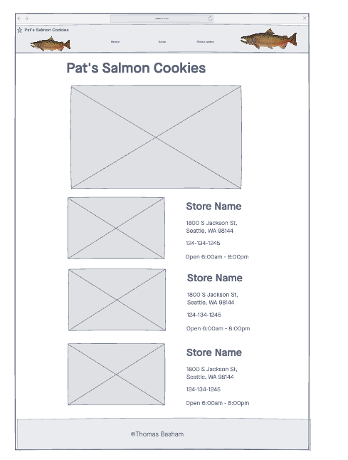
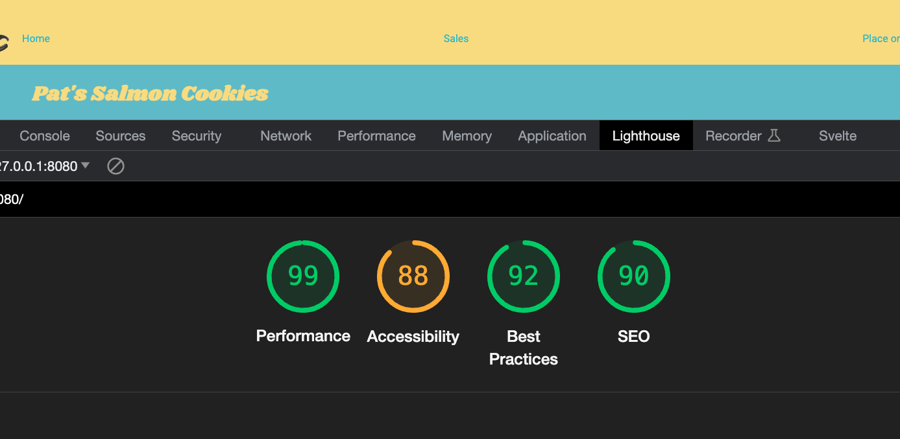

# Salmon Cookies

Pat has developed a recipe for a coffee-time confection called Salmon Cookies. These cookies made into the shape of a salmon and are suitable for both humans and salmon to enjoy.

Pat needs some help with the branding of the business, as well as some help with internal data management for the company, and has enlisted your assistance because of your extensive and proven work in developing web applications.

Pat’s Salmon Cookies, soon with franchises internationally, needs a proof of concept application to calculate the number of cookies each location must make every day so that it can manage its supplies inventory and baking schedule. The number of cookies to make depends on the hours of operation (6:00 AM to 8:00 PM for all locations) and a few factors unique to each location:

## Author: Thomas Basham

### Links and Resources

- [submission PR](https://github.com/Thomas-Basham/lab-06-cookie-stand/pull/1)
- [coolors](https://coolors.co/)
- [JavaScript Objects](https://www.w3schools.com/js/js_objects.asp)
- [Wireframe](https://projects.invisionapp.com/freehand/document/9Uqbpb8pi)

### Lighthouse Accessibility Report Score

